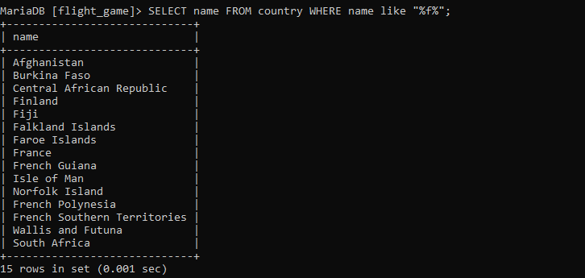

# Tietokannat Ohjelmisto 1

# Relaatiotietokannan peruskäsitteiden harjoitukset

# Tietokannan suunnittelu harjoitukset

# Yhteen tauluun kohdistuvien kyselyiden harjoitukset

### Tehtävä 1

SELECT * FROM goal

### Tehtävä 2

SELECT * name FROM airport WHERE iso_country = "FI"

### Tehtävä 3

SELECT name FROM airport WHERE iso_country="FI" ORDER BY name ASC

### Tehtävä 4

SELECT name, type FROM airport WHERE iso_country="FI" ORDER BY type, name 

### Tehtävä 5

SELECT name FROM country WHERE name like "F%"

### Tehtävä 6

SELECT name FROM country WHERE name like "%f%"

### Tehtävä 7

select location from game where screen_name = "Vesa"

### Tehtävä 8

select co2_consumed from game where screen_name = "Ilkka"

### Tehtävä 9

select distinct co2_budget From game

# Where-osan liitosehto harjoitukset

### Tehtävä 1

select country.name as "country name", airport.name as "airport name"
from airport, country
where airport.iso_country = country.iso_country and country.name = "Iceland";

### Tehtävä 2

select airport.name as "airport name"
from airport, country
where airport.iso_country = country.iso_country and country.name = "France" and airport.type = "large_airport"

 

### Tehtävä 3

select country.name as "country_name", airport.name as "airport_name"
from airport, country
where country.continent like 'AN' AND airport.iso_country like country.iso_country 

 

### Tehtävä 4

Select elevation_ft
From airport, game
where game.screen_name like 'Heini' and game.location like airport.ident

 

### Tehtävä 5

SELECT (elevation_ft * 0.3048) AS elevation_m
FROM airport, game
WHERE game.screen_name LIKE 'Heini' AND game.location LIKE airport.ident;

  

### Tehtävä 6

SELECT name 
FROM airport, game
WHERE game.screen_name LIKE 'Ilkka' AND game.location LIKE airport.ident

  

### Tehtävä 7

Select country.name as "name"
From country, airport, game
where game.screen_name = "Ilkka" and game.location = airport.ident and airport.iso_country = country.iso_country 

 

### Tehtävä 8

 
select name
from goal, goal_reached, game
where game.id = game_id and goal.id = goal_id and screen_name = "Heini";

 

### Tehtävä 9 

select airport.name
    from airport, game, goal, goal_reached
    where game.screen_name = "Ilkka" and goal.name = 'CLOUDS' AND game.id = goal_reached.game_id and goal_reached.goal_id = goal.id and game.location = airport.ident

 

### Tehtävä 10 

select country.name
     from country, goal, goal_reached, airport, game
    where game.screen_name = "Ilkka" AND goal.name = 'CLOUDS' AND game.id = goal_reached.game_id and goal_reached.goal_id = goal.id and game.location = airport.ident AND airport.iso_country = country.iso_country
    
 

