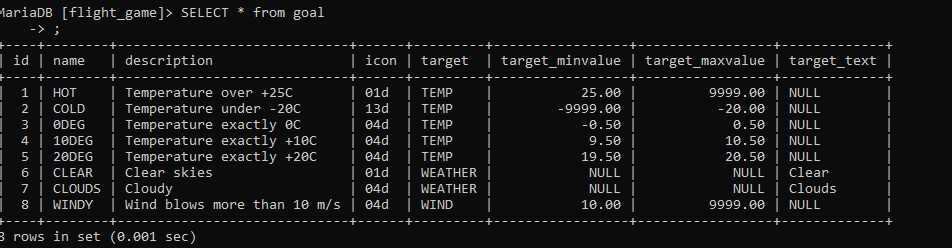

# Tietokannat Ohjelmisto 1

# Relaatiotietokannan peruskäsitteiden harjoitukset

# Tietokannan suunnittelu harjoitukset

# Yhteen tauluun kohdistuvien kyselyiden harjoitukset

### Tehtävä 1

SELECT * FROM goal

### Tehtävä 2

SELECT * name FROM airport WHERE iso_country = "FI"

### Tehtävä 3

SELECT name FROM airport WHERE iso_country="FI" ORDER BY name ASC

### Tehtävä 4

SELECT name, type FROM airport WHERE iso_country="FI" ORDER BY type, name 

### Tehtävä 5

SELECT name FROM country WHERE name like "F%"

### Tehtävä 6

SELECT name FROM country WHERE name like "%f%"

### Tehtävä 7

select location from game where screen_name = "Vesa"

### Tehtävä 8

select co2_consumed from game where screen_name = "Ilkka"

### Tehtävä 9

select distinct co2_budget From game

# Where-osan liitosehto harjoitukset

### Tehtävä 1

select country.name as "country name", airport.name as "airport name"
from airport, country
where airport.iso_country = country.iso_country and country.name = "Iceland";

### Tehtävä 2